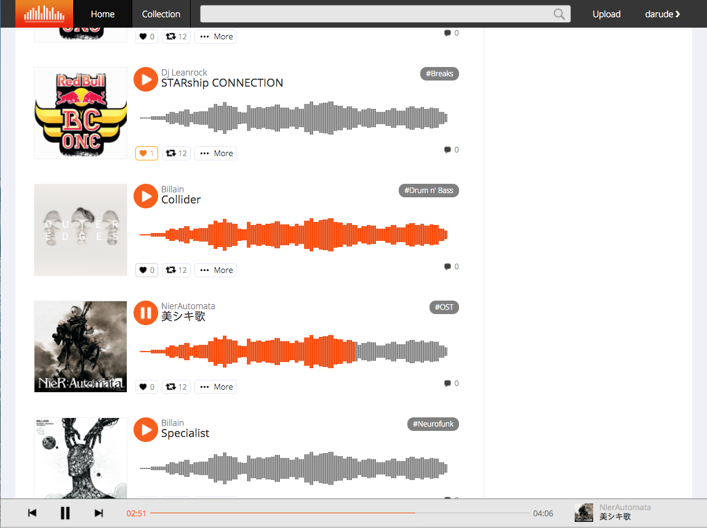
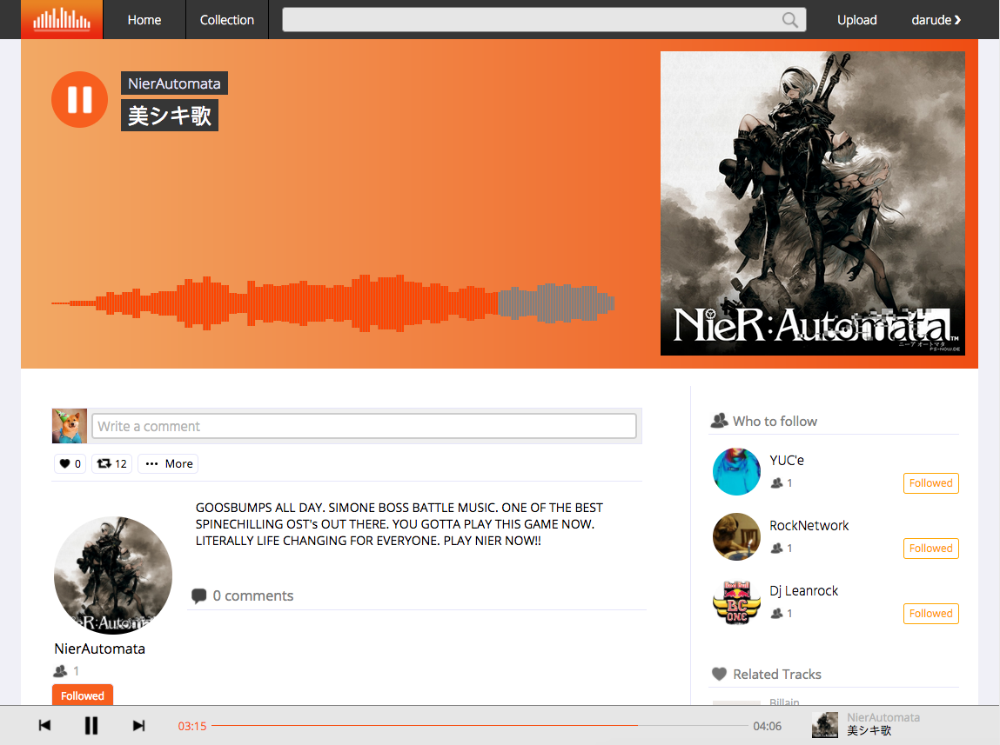

# Vibe

[Vibe live](https://vibemusic.herokuapp.com/)

Vibe is a full-stack web application inspired by Soundcloud.  It utilizes Ruby on Rails on the backend, a PostgreSQL database, and React.js with a Redux architectural framework on the frontend.  

## Features & Implementation

### Sidebar (Songs and Users state)

  Song information are all stored in one table in the database, which contains basic song information such as the `artist`, `title`, `genre`, and vice versa. Upon logging in, the user will be directed to his or her personal homepage which will show a list of songs from artists that the user follows, or just random songs from the database if the user follows no one or follows too little people.

  Each song is created by some user, which is stored in the database as the song's `author_id`. Of course, this relationship in the database was not hard to create, but passing the information properly, quickly, and responsively took a little effort, especially when it came to passing down the information to the right components.

  The sidebar was a tough feature to implemented properly, because in order for favorites and follows to work fluidly, both the sidebar and the main song index needed to be updated when a follow or favorite was created or destroyed. There was also the added problem of sending the correct user and song information to it from the state. The solution to this problem was through adding a nested key inside my songs slice of state, and adding a separate component state which kept track of which songs and users needed to be updated and passed down.

```
{
  songs: {
    1: {
      title: "Sandstorm",
      artist: "darude",
      author_id: 1,
      genre: "Sandstorm",
      image_url: 'google.com/pictures',
      track_urlL: 'soundcloud.com/song',
      Album: "Memes and Giggles",
      favorites: {
        1: {
          id: 5,
          username: "Janice"
        }
      }
      user: {
        id: 1,
        username: 'darude'
      }
    }
    2: {
      ...
    }

    ...etc
    random: {
      1: {
        title: "Still Echoes",
        artist: "Lamb of God",
        author_id: 1,
        genre: "Metal",
        image_url: 'google.com/pictures',
        track_urlL: 'soundcloud.com/song',
        Album: "VII: Sturm und Drang",
        favorites: {
          1: {
            id: 5,
            username: "Janice"
          }
        }
        user: {
          id: 2,
          username: 'Ranelle'
        }
      }

      ...etc
    }
  }
```
```js
class SideBar extends React.Component {
  constructor (props) {
    super(props);
    this.state = { offset: 0, userIds: [], songIds: [] };
  }
}
```

A tricky problem getting this sidebar to work was the fact that either the follow button or favorite button would not update both the sidebar and the index, or if implemented incorrectly, favoriting a song would add an extra song onto the song listing. Using this method, despite having separate components render the song listings and the sidebar listings, users and songs would be updated on both components upon receiving some kind of prop without altering the songs or users that were already fetched for that state.

### Playbar and Waveforms

The playbar was quite a challenging feature to build from scratch. Albeit seemingly simple to function, it requires a lot of attention to detail to pass around the audio information to different components completely unrealted to the playbar. The easiest solution was to create another slice of state solely dedicated to the audio that was playing. This would keep track of the song that was playing, whether or not the song is currently playing, and the audio player html element that was used to play the music.

```
{
  audio: {
    song: {
      id: 1,
      title: 'Love Ya',
      author_id: 3,
      etc...
    },
    player: 'Audio Element',
    isPlaying: false
  }
}
```

In addition to this, there required many conditional renderings for the element to maintain that the correct indicators would still be showing for a given song on different pages. A succinct way to accomplish this was by making the play bar the one true state of the audio playing. Similar to how the store is the one true state of the web app, by making the playbar the one true state for the audio, all other elements which would have to conditionally render could base its own state on the playbar (e.g. whether or not its own song prop was the same as the audio playing). This allowed state to be transferred between different components and different routes.

In this way, whenever the audio slice of state changed, this would get passed to the playbar and it would know exactly how to respond. On a similar note, waveform scrolling acted upon this audio slice of state to update itself in accordance with the audio.

```js
componentWillReceiveProps(nextProps) {
  let audio = this.props.audio;
  if (audio.isPlaying) {
    this.activatePlayer();
    audio.player.play();
    this.setState({
      icon: 'pause-button.png'
    });
  } else if (audio.isPlaying === false) {
    audio.player.pause();
    this.setState({
      icon: 'play-button.png'
    });
    this.pausePlayer();
  }
}
```




The playbar feature does not just include real-time updating of state, but also the ability to scroll through a list of songs for an endless playing experience. This was done by adding another key to the songs slice of state, in addition to the sidebar songs:

```
{
  songs: {
    1: {
      ...
    }
    2: {
      ...
    }
    random: {
      ...
    }
    order: [
      songId1,
      songId2,
      songId3,
      ...
    ]
  }
```

Everytime a song was passed into the state, its `id` would be pushed into the order array. Wheter you skip or let the song pass by itself, when a song ended, the playbar would find the song it was currently playing inside the order array and correctly choose the next song to play. This not only solves the problem continuous play, but also solves the problem of correctly order the songs on the main index when rendering more songs for infinite scroll. Furthermore, sometimes songs would be added to the state for fetching other data for the user, and this organization prevents this new data from affecting the proper order of songs.

## Future Directions for the Project

### Playlists and Reposts

Playlists are a core functionality for music sharing sites, but because of limitations in time there was not time to flesh out playlists bug-free and with fluid navigation. Reposts would be nice to have as an addition to the song feed.

### Smarter feed and Suggestions

For a better functioning site, the algorithms for the suggestions and the feed would need to be more appealing for the user. Of course, this is more trivial when it comes to the functionality of the site.
